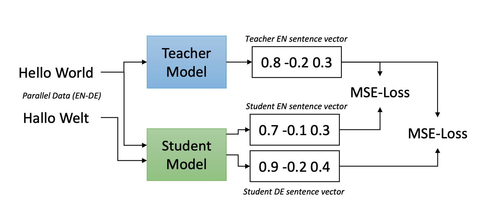

# Paper: Making monolingual sentence embeddings multilingual using KD

Created: June 17, 2021 11:35 PM

Paper : https://arxiv.org/abs/2004.09813

1. Teacher model is trained on only english STS or english paraphrases using SBERT architecture
2. Student model is initialized with XLM-Roberta weights and tokenization. Since XLM uses sentence piece tokenization (opposed to BERT's word piece tokenization), it is extendible to multi lingual corpus from raw text.
3. English sentence is passed to the teacher model and parallel sentence is passed to student model. Objective is to make the student model's english embeddings and non english embeddings in the same space as the teacher's english embedding.

Interesting observations :

 Bilingual XLM models are slightly better as students than the model trained for 10 languages (section 4.1): 2.2 points improvement for EN-DE and 1.2 points improvement for EN-AR. Conneau et al. (2019) calls this curse of multilinguality, where adding more languages to a model can degrade the performance as the capacity of the model remains the same.

 