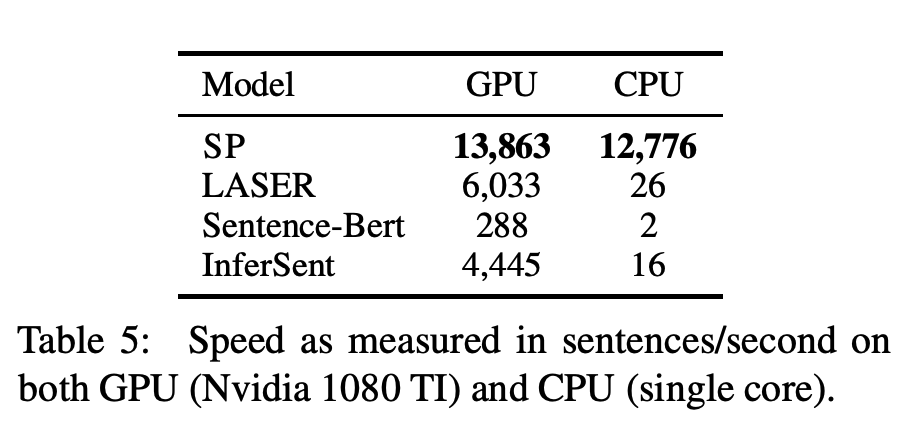
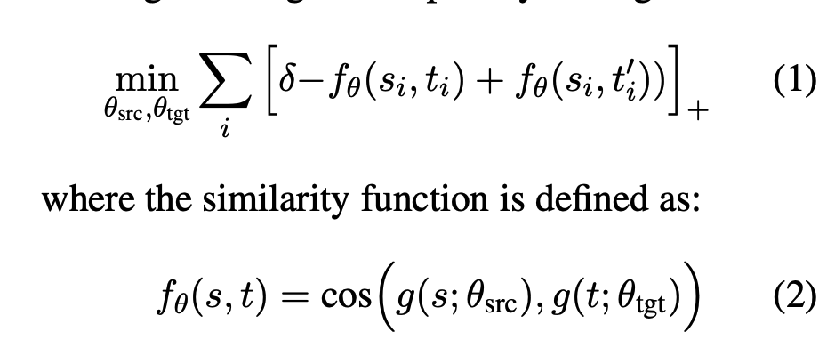

# [2104.15114] Paraphrastic Representations at Scale

Created: June 24, 2021 11:44 PM
Tags: papers
URL 3: https://arxiv.org/abs/2104.15114

### What ?

Simple word embedding-based model that outperforms SBERT on unsupervised sentence similarity tasks. Inference and training throughput is order of magnitude better 🤯

### How:

Sentences are encoded by mean pooling the sentence-piece embeddings of the sentence. training is done with similarity objective to make the positive sentence closer and negative sentence far by a margin.

Only embeddings are learnt during the training process.

Negative sample selection:

1. Most closest non-pair sentence based on cosine similarity
2. Mega-batching : A mega batch is created by combining multiple mini-batches. Negative samples are picked from this mega batch. Once all the positive pairs have a negative pair. the mega batch is again split into mini-batches. This seems to give a good improvement in accuracy. 

Dataset : [ParaNMT-50M - 50 million english paraphrase corpus by back translation](https://www.notion.so/ParaNMT-50M-50-million-english-paraphrase-corpus-by-back-translation-fa9b5dccd3e548e5912ec7fbd013dade) 

### What is better?

With enormous training dataset - 25M paraphrases the model is able to learn good representations with just token embeddings. **data >> algorithm**