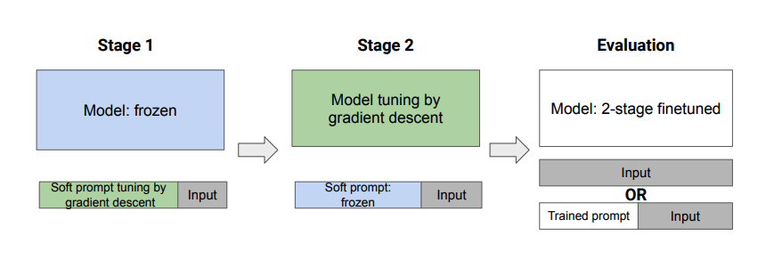
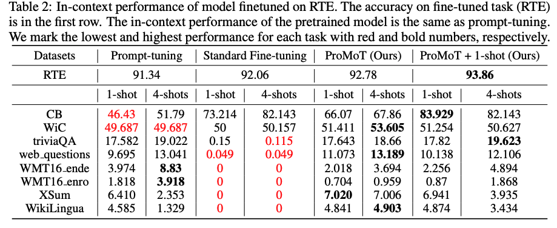

# [2211.00635] Preserving In-Context Learning ability in Large Language Model Fine-tuning

## What did the author accomplish ?

1. Authors show that the in-context learning ( Few shot / Zero shot ) ability deteriorates after task/format specific fine-tuning due to model adapting only to a format of fine-tuning.
2. Author propose a two stage solution to alleviate this:

## What are the key elements of the approach ?

1. Author propose a two stage solution to alleviate this:
    1.  Prompt tuning to learn a soft prompt for the task, Freezing the model weights
    2.  Finetuning the model with soft prompt 
    
    
    

#### Results:

#### Observations / Comments :

1. Standard finetuning : 
- Tasks adhering to the same format shows improvement ( CB and WiC ). RTE is a binary classification format , CB and WiC are also binary classification
- Tasks not adhering to the format deteriorates to near zero value
2. After ProMot:
- Few shot scores on the tasks that the model was not fine-tuned on improves and better than standard fine-tuning. 
- Some of the tasks like WMT16 still does not reach to the pre-finetuning levels

## References to further follow / read ?