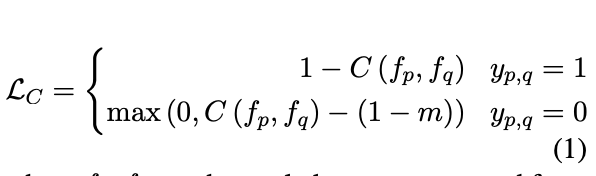
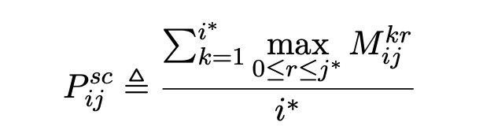
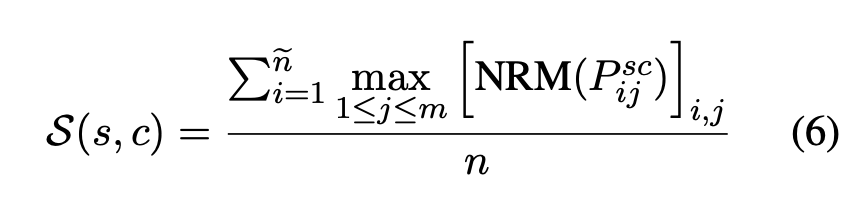
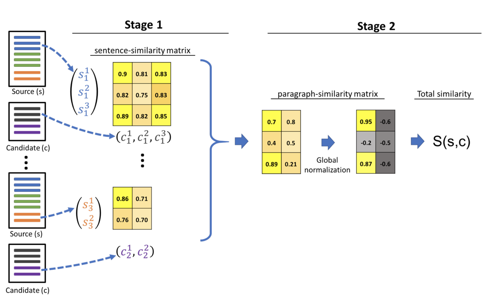

# SDR - Self supervised Document similarity

Created: November 28, 2021 11:50 PM
Tags: papers

Repo URL: https://github.com/microsoft/SDR
Paper: [https://arxiv.org/abs/2106.01186](https://arxiv.org/pdf/2106.01186.pdf)

## Notes:

### **Summary:**

Introduces a new way to calculate document similarity by just using sentence vectors and similarity with hierarchical inference.  Also introduces a novel way to pretrain sentence vectors that suit document similarity

### How:

Pretraining :

- Pretrains using a contrastive loss function , which considers sentences in same documents to be positive pairs and sentences from different documents to be negative pairs.
- Since the sentences from other documents need not be always negative, the loss is designed such a way that the cosine similarity of the negative pairs are not pushed too far between (0 and -1 ), but remains in 0 (orthognality). This aspect is shown to improve the performance in the ablation study.

Inference:

- Documents are split into paragraphs and sentences
- similarity matrix:
    - First paragraph wise sentence similarity matrix is calculated. This is done by comparing all the sentences of the source paragraph to candidate sentences in a candidate paragraph
        
        
        Paragraph similarity scores are calculated by this :
        
        
        
    - From the paragraph scores , document level scores are calculated by Z-score normalizing the paragraph scores and applying the below ,
    
    
    

**Results of Interests :**

1. SBERT with just SDR inference, without pertaining shows better performance than just vanilla SBERT and shows slightly closer performance to SDR pretrained and SDR inference results.
2. SDR pre-trained and SDR inference - gives the best overall performance.
3. SDR outperforms SBERT by a significant margin, even when SBERT is applied with SDRinf. This is due to SDR training, which incorporates the contrastive loss for promoting orthogonality between negative sentence-pairs